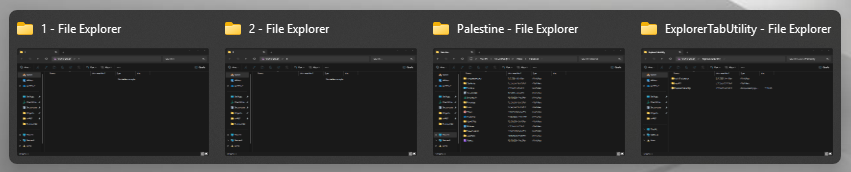
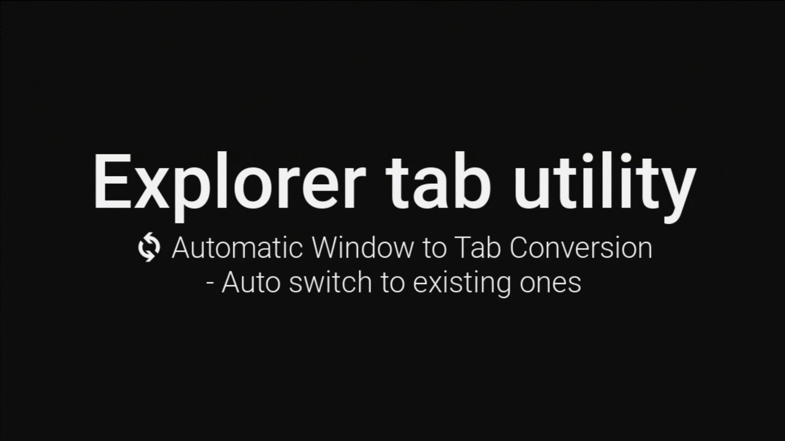
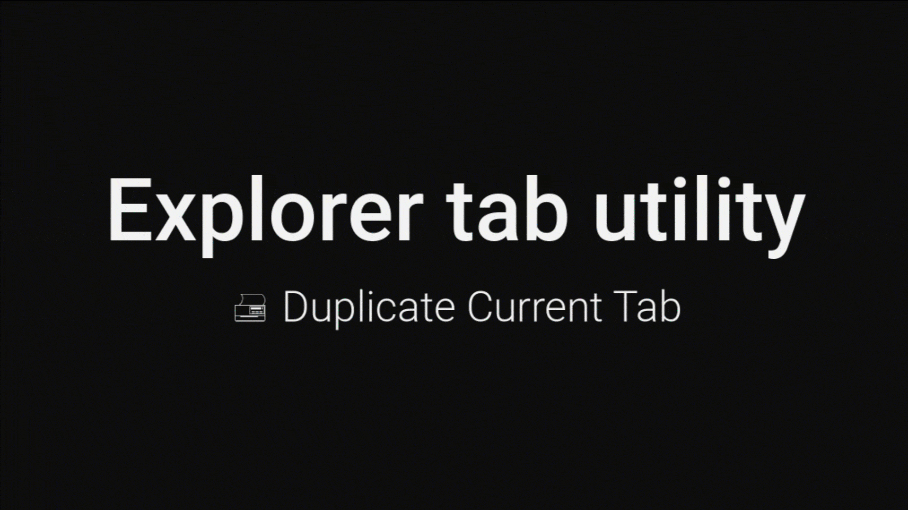
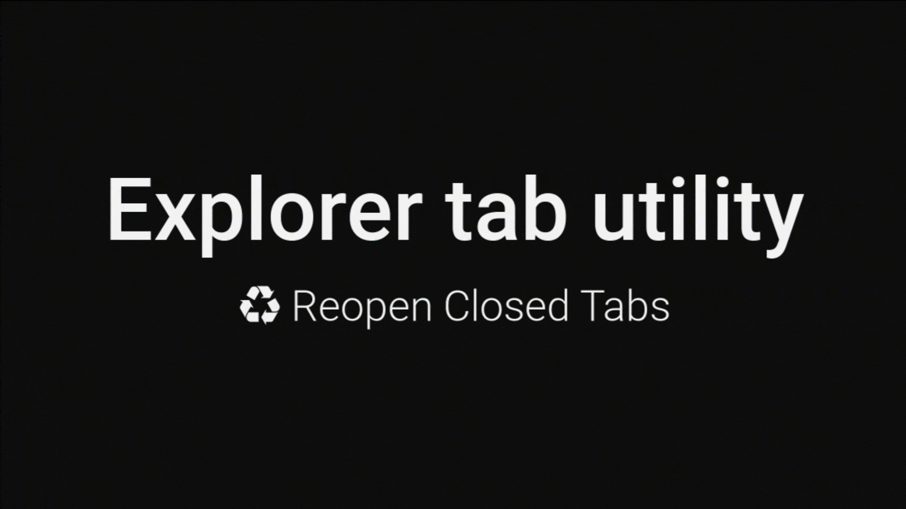
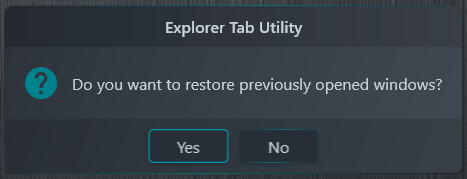
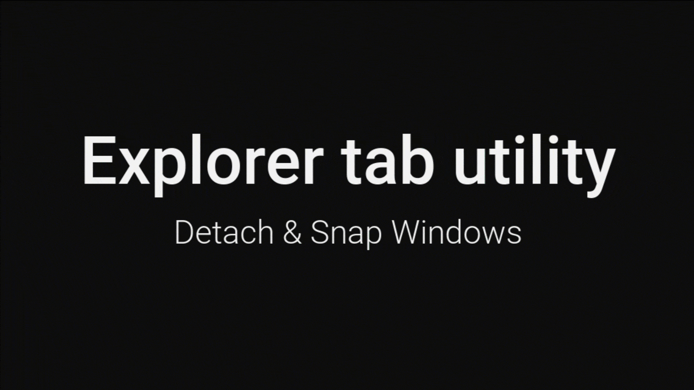

# Explorer Tab Utility (文件资源管理器标签页工具)

> [!TIP]
> 强制 Windows 11 中的新文件资源管理器窗口在标签页中打开，让您的工作流程更整洁、更有条理！

> [!IMPORTANT]
> 本应用程序需要 Windows 11 (22H2 Build 22621 或更高版本) 并已启用文件资源管理器标签页功能。

## 🤔 为什么选择 Explorer Tab Utility？

告别因多个资源管理器窗口而混乱的桌面！Explorer Tab Utility 能自动将新窗口转换为标签页，提供更干净、更有条理的文件管理体验。

## ✨ 功能特性

🔄 **自动将窗口转换为标签页**
*   无缝地将新的资源管理器窗口转换为标签页
*   如果路径已在现有标签页中打开，则会自动切换过去
*   支持使用热键在虚拟桌面间切换
*   支持附加/分离标签页
*   优雅地处理“在文件夹中显示”的文件选中操作
*   支持一次性打开多个标签页

**实际效果:**

🖨️ **复制当前标签页**
*   快速复制当前标签页/窗口
*   可选择复制为标签页或新窗口 (通过切换 `标签页` 选项)
*   保留当前位置和已选中的项目

**实际效果:**

♻️ **重新打开已关闭的标签页**
*   重新打开之前关闭的标签页/窗口
*   可选择重新打开为标签页或新窗口 (通过切换 `标签页` 选项)
*   恢复关闭时的确切位置和已选中的项目
*   关闭历史记录可在程序重启后保留 (需在设置中启用“保存关闭历史”)

**实际效果:**

🔄 **恢复之前的窗口**
*   在文件资源管理器重启/崩溃或系统重启后，自动恢复之前打开的窗口
*   可通过“恢复之前的窗口”设置进行配置
*   首次启动时会弹出确认对话框，让您选择是否恢复窗口

📋 **分离与贴靠窗口**
*   将当前标签页分离为新窗口
*   将窗口贴靠到屏幕边缘 (右/左/上/下)
*   通过单个热键实现多个动作链
*   **临时覆盖窗口挂钩和标签页复用设置**
    *   当您需要在不更改全局设置的情况下临时打开新窗口时，此功能非常有用
    *   **示例**:
        1.  在 `打开` 动作类型中设置热键 (例如 `Ctrl + N`)
        2.  启用 `标签页` 选项
        3.  启用 `覆盖` -> `窗口挂钩`
        4.  启用 `覆盖` -> `复用标签页`
    *   现在，当您按下 `Ctrl + N` 时，即使全局启用了窗口挂钩和复用标签页，也总会打开一个新窗口

**实际效果:**

## 💝 支持项目

如果您觉得 Explorer Tab Utility 对您有帮助，请考虑支持它的发展：

[[GitHub Sponsors](https://github.com/sponsors/w4po)] [[Patreon](https://patreon.com/w4po)] [[Buy Me A Coffee](https://buymeacoffee.com/w4po)] [[PayPal](https://paypal.me/w4po77)]

您的支持有助于维护和改进这个项目！ ❤️ 